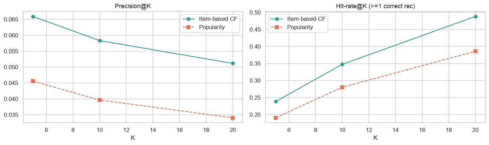

# 🛒 E-Commerce Recommendation Engine — Real Data, Real Evaluation


An **item-based collaborative-filtering** recommender ("customers who bought this also bought…") — evaluated **honestly** against a held-out future period and compared to a popularity baseline.

Built on the real **[UCI Online Retail II](https://archive.ics.uci.edu/dataset/502/online+retail+ii)** dataset — 805k clean transactions, **5,878 customers, 4,631 products**.

> **Behavioural angle:** the engine learns implicit product relationships purely from collective purchasing behaviour — what people *actually* buy together — with no product metadata.

---

## 📊 Results (offline, temporal hold-out, k=10)

| Method | precision@10 | recall@10 | hit-rate@10 |
|--------|-------------:|----------:|------------:|
| **Item-based CF** | **0.058** | **0.022** | **0.35** |
| Popularity baseline | 0.040 | 0.013 | 0.28 |

**Collaborative filtering beats "just recommend the best-sellers" by ~1.5× on precision**, and gives **1 in 3 returning customers at least one correct recommendation** in their top 10 — measured on **2,291 customers' actual future purchases**.



*(Absolute precision of ~6% is normal for sparse retail CF — the honest, meaningful signal is the lift over the popularity baseline and the 35% hit-rate.)*

---

## 🧪 Methodology
1. **Cleaning** — drop missing customers, cancellations and returns → 805k transactions ([`src/recommender.py`](src/recommender.py)).
2. **Leakage-safe temporal split** — build similarities on transactions up to a cutoff; evaluate on the final 3 months. Keep products bought by ≥20 customers so similarities are reliable.
3. **User–item matrix** — sparse binary customer × product matrix (~2.4% dense).
4. **Item–item similarity** — cosine similarity between product vectors.
5. **Qualitative sanity check** — inspect the most-similar products for a sample item (they're sensible co-purchases) *before* trusting any metric.
6. **Offline evaluation** — precision@k / recall@k / hit-rate at k = 5, 10, 20 vs a popularity baseline.

## 🧰 Tech Stack
Python · pandas · NumPy · SciPy (sparse) · scikit-learn (cosine similarity) · Matplotlib · Seaborn

---

## 📁 Repository Structure
```
├── README.md
├── requirements.txt
├── notebooks/
│   └── ecommerce_recommendation_engine.ipynb
├── src/
│   └── recommender.py        # reusable ItemCFRecommender class + cleaning
├── data/                     # download instructions — see data/README.md
├── images/
└── docs/
```

## 🚀 How to Run
```bash
git clone https://github.com/kndukuba17-hub/B2C-Retail-Analytics-E-Commerce-Recommendation-Engine.git
cd B2C-Retail-Analytics-E-Commerce-Recommendation-Engine
pip install -r requirements.txt
# download online_retail_II.xlsx into data/ (see data/README.md), then:
jupyter notebook notebooks/ecommerce_recommendation_engine.ipynb
```

## 🗺️ Roadmap
- TF-IDF / BM25 weighting of the user-item matrix.
- Matrix factorisation (implicit ALS) as a stronger benchmark.
- Blend CF with a popularity/content fallback to handle cold-start.

---
### 🎤 Interview talking points
- *"How do you evaluate a recommender without labels?"* Temporal split — similarities from the past, scored against customers' *actual* future purchases (precision@k / recall@k / hit-rate).
- *"Why compare to popularity?"* It's the honest baseline; a recommender that can't beat best-sellers adds no value. Mine beats it ~1.5×.
- *"Cold-start?"* CF needs history — fall back to popularity/content for new users and products.
